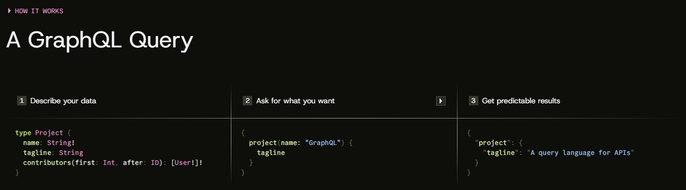

# GraphQL
*GraphQL - (Grafo Query Language)*

- É uma linguagem de consulta para APIs criada pelo Facebook em 2012 e aberta em 2015.
- **Over-fetching**: No modelo REST, quando você faz uma requisição a um endpoint, o servidor frequentemente retorna muito mais dados do que o necessário (ex: retornar todos os dados de um usuário quando você precisa apenas do nome). Isso gera tráfego de rede desnecessário e desperdício de recursos, especialmente em conexões lentas ou serviços pagos por volume de dados.

## Como o GraphQL resolve isso:
- **Consultas precisas**: Com o GraphQL, o cliente solicita exatamente os campos de dados que precisa, e o servidor retorna apenas o solicitado.

- **Unificação de dados**: Ele atua como uma camada que pode agregar informações de múltiplos servidores (como microsserviços de clientes, compras e produtos) e entregar tudo em uma única requisição, evitando múltiplas chamadas de rede.

- **Endpoint único**: Ao contrário do REST, que possui vários endpoints, o GraphQL utiliza um único endpoint para realizar todas as operações via requisições POST.

