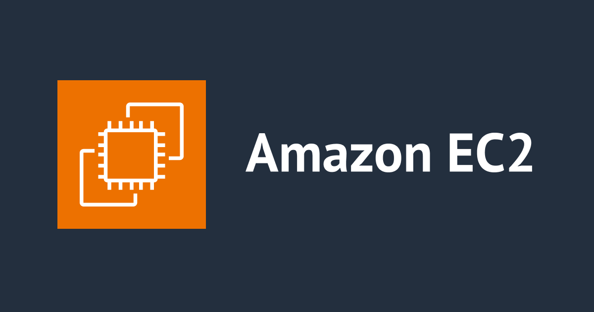
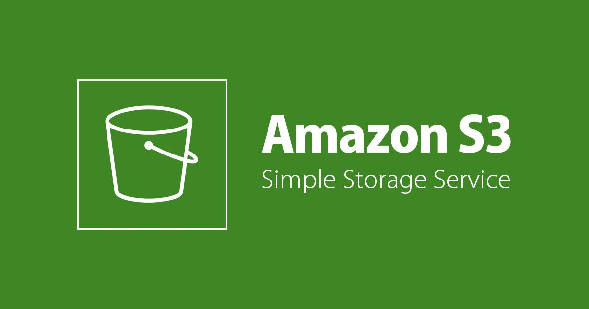
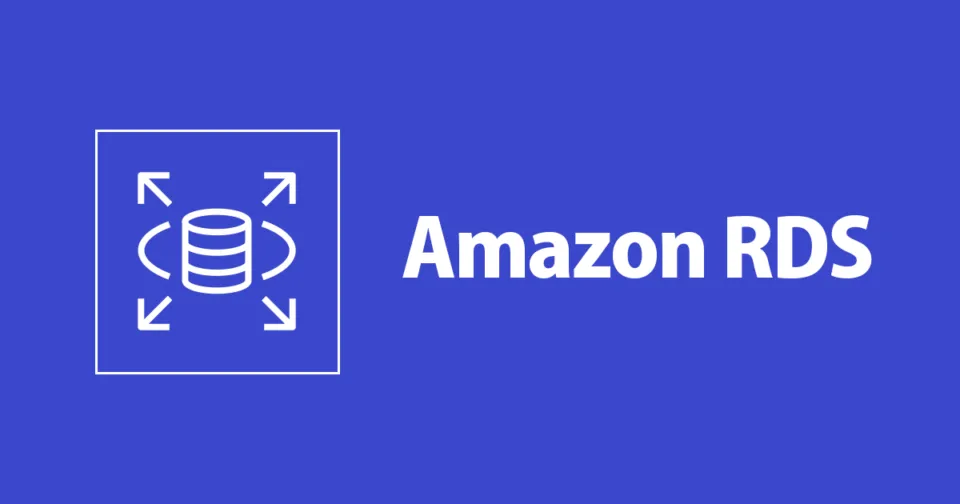
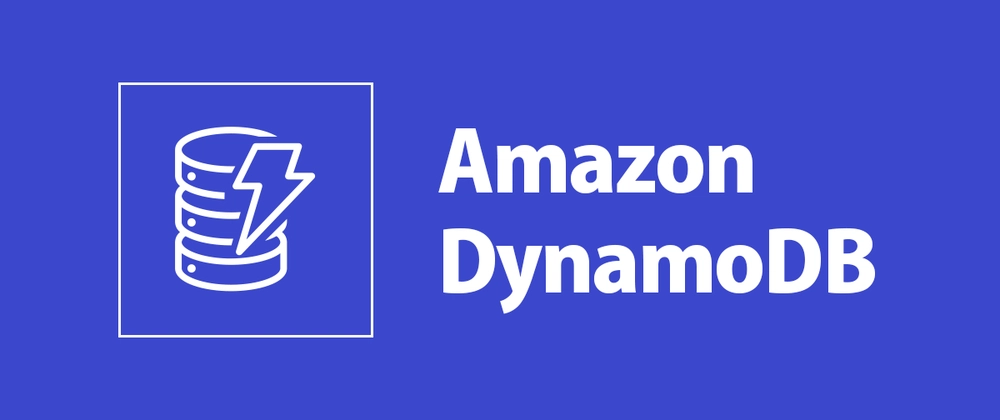
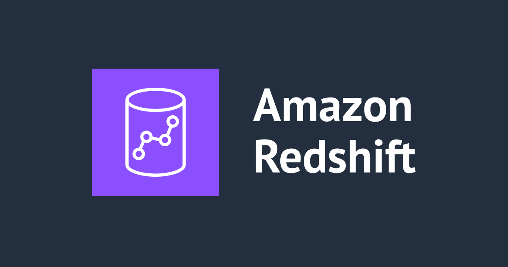
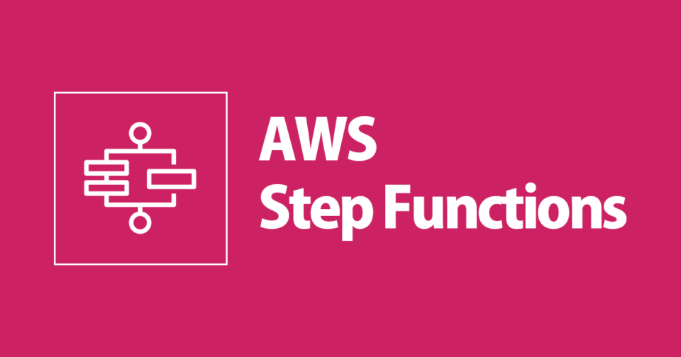
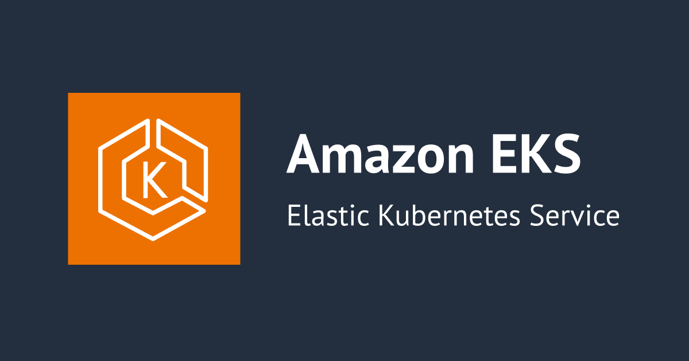
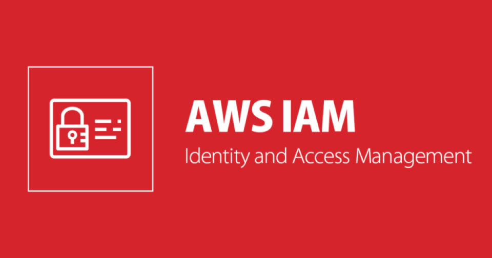

Os principais serviços da `AWS` são:

1. Compute (Maquinas Virtuais):

2. Storage (Arquivos / Data Lake):

3. Banco Relacional:

4. Banco NoSQL:

5. Data Warehouse:

6. Serverless (código sem servidor):

7. Orquestração de Workflows:

8. Container / Kubernetes:

9. Controle de Acessos:

10. Monitoramento e Logs:
