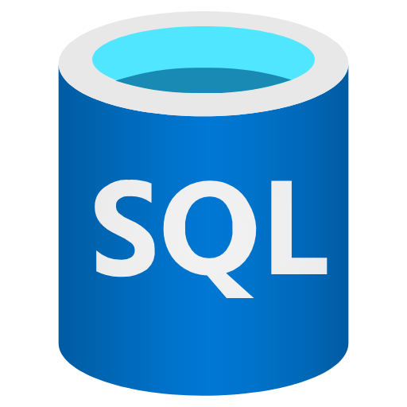
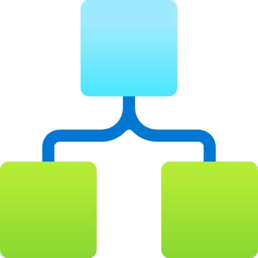

Os principais serviços da `Azure` são:

# 1. Compute (Maquinas Virtuais):
#### Virtual Machines (Classic)

# 2. Storage (Arquivos / Data Lake):
#### Storage Azure Files

# 3. Banco Relacional:
#### SQL Database 

# 4. Banco NoSQL:
#### Azure Cosmos DB 

# 5. Data Warehouse:
#### Synapse Analytics

# 6. Serverless (código sem servidor):
#### Azure Functions

# 7. Orquestração de Workflows:
#### Logic Apps

# 8. Container / Kubernetes:
#### AKS

# 9. Controle de Acessos:
#### Entra Identity Custom Roles

# 10. Monitoramento e Logs:
#### Monitor
