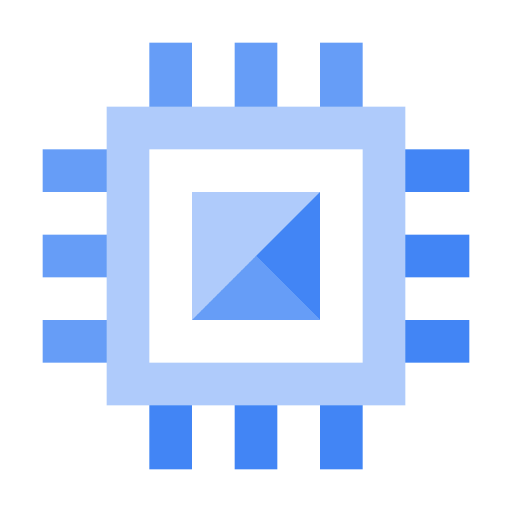
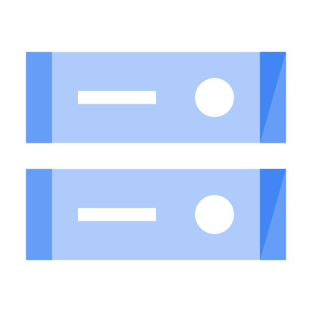
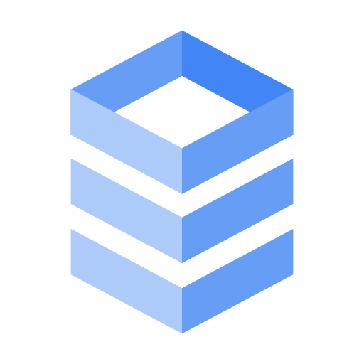
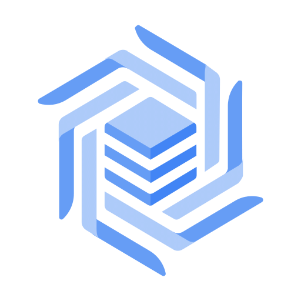
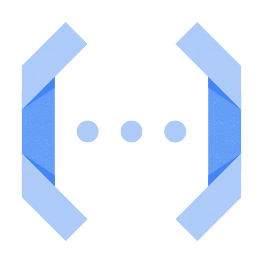
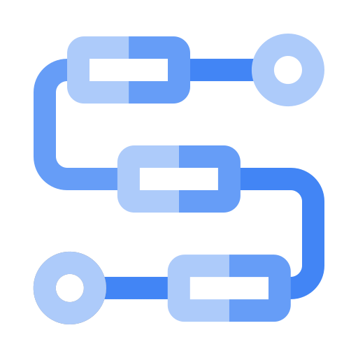
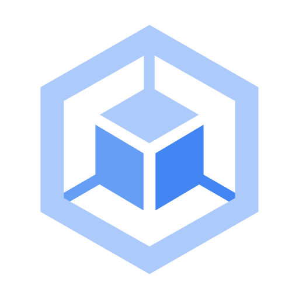
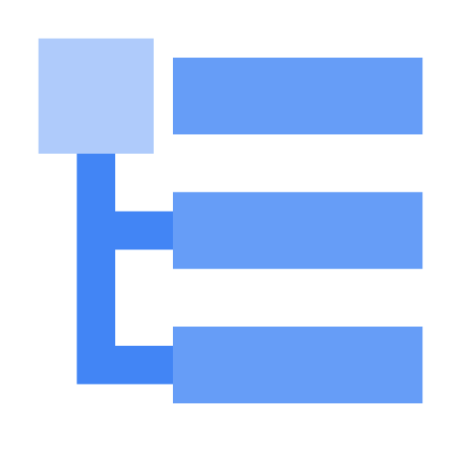
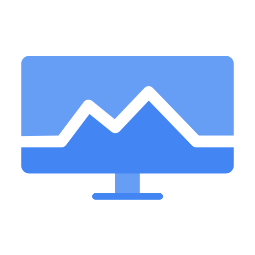

Site: https://cloud.google.com/
Os principais serviços da `GCP (Google Cloud Plataform)` são:

# 1. Compute (Maquinas Virtuais):
#### Compute Engine

# 2. Storage (Arquivos / Data Lake):
#### Cloud Storage

# 3. Banco Relacional:
#### Cloud SQL

# 4. Banco NoSQL:
#### Firestore

#### Big Table

# 5. Data Warehouse:
#### BigQuery

# 6. Serverless (código sem servidor):
#### Cloud Functions

# 7. Orquestração de Workflows:
#### Workflows

#### Cloud Composer (Airflow)

# 8. Container / Kubernetes:
#### GKE

# 9. Controle de Acessos:
#### IAM

# 10. Monitoramento e Logs:
#### Cloud Logging 

#### Cloud Monitoring
