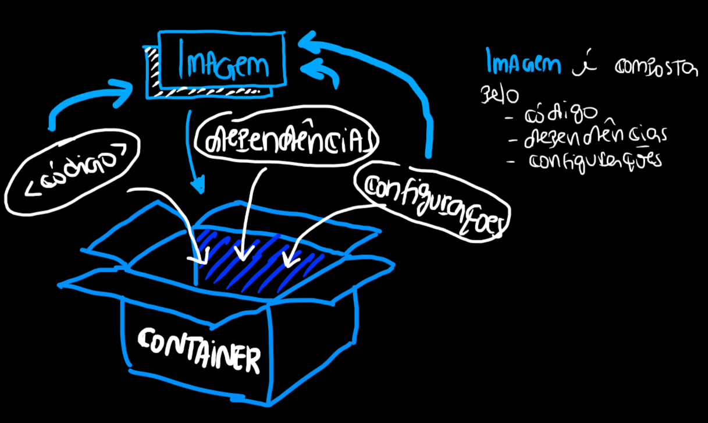

# O que é o Docker
O `Docker` é uma ferramenta que empacota e isola aplicações. É como se fosse uma caixa com tudo que você precisa para sua aplicação rodar e não precisasse de mais nada só de ter ela tudo já vai funcionar.


# Imagem
A `Imagem` é a receita/molde do seu container ela que diz o que o container vai fazer. Perceba que o container é o que isola, a imagem é o que configura o que será isolado. Nela teremos qual sistema usar, quais libs instalar e qual código utilizar.

# Container
O `Container` é uma **instancia** da imagem rodando é a execução real do que está na `Imagem`.

# Dockerfile
O `DockerFile` são as instruções para se criar uma `Imagem`. Ele é o script que define sua imagem. Veja o exemplo abaixo:
```dockerfile
FROM python:3.14         ← camda 1

WORKDIR /app             ← camada 2

COPY app.py              ← camada 3

CMD ["python", "app.py"] ← camada 4
```

# Build
O `build` cria a sua `Imagem` a partir do seu `DockerFile`.
```bash
docker build -t my-first-image .
```
O `build`:
1. Baixa a imagem base (neste caso *python:3.14*)
2. Cria as camadas (layers)
3. Copia os arquivos
4. Salva tudo como uma `Imagem`

# Run
Agora que já temos a `Imagem` podemos rodar o seu `Container`:
```bash
docker run my-first-image
```

# Docker Hub
É como um `github` de imagens você pode baixar `Imagens` já prontas ou até subir as suas próprias `Imagens`.

---
# Comandos
- `docker run`: Cria ou inicia um novo container a partir de uma imagem:
```bash
docker run [OPÇÕES] IMAGEM [COMANDO] [ARGUMENTOS]

# Executar um container em modo interativo (com terminal)
docker run -it ubuntu bash

# Executar em background (detached mode)
docker run -d nginx

# Mapear portas (host:container)
docker run -p 8080:80 nginx
```
- `docker pull`: Baixa uma imagem do registry (Docker Hub) para sua maquina.
```bash
docker pull [OPÇÕES] IMAGEM[:TAG|@DIGEST]

# Baixar a última versão (latest)
docker pull nginx

# Baixar versão específica
docker pull nginx:1.21

# Ver imagens baixadas
docker images

# Ver detalhes de uma imagem
docker inspect nginx
```
- `docker ps`: Lista os containers em execução.
```docker
docker ps [OPÇÕES]
# Listar containers em execução
docker ps

# Listar TODOS os containers (incluindo parados)
docker ps -a

# Mostrar apenas IDs (útil para scripts)
docker ps -q
```
- `docker stop`: Para um ou mais containers em execução.
```bash
# Parar um container
docker stop meu-nginx

# Parar múltiplos containers
docker stop container1 container2 container3

# Parar todos os containers em execução
docker stop $(docker ps -q)

```
- `docker rm`: Remove um ou mais containers parados.
```bash
# Remover um container parado
docker rm meu-nginx

# Remover múltiplos containers
docker rm container1 container2
```