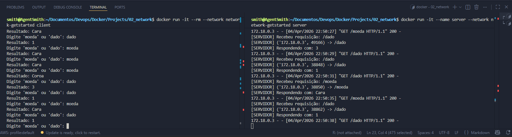

# Criando a Rede (Network)
```bash
docker network create nome-da-rede
```
# Build (Cliente e Servidor)
```bash
# o `-t` cria uma tag (nomeia) sua imagem
docker build -t server ./server
docker build -t client ./client
```
# Sobe o servidor primeiro
```bash
# 1º
docker run -it --name server --network network-getstarted server
```
# Sobe o Cliente
```bash
docker run -it --rm --network network-getstarted client
```
