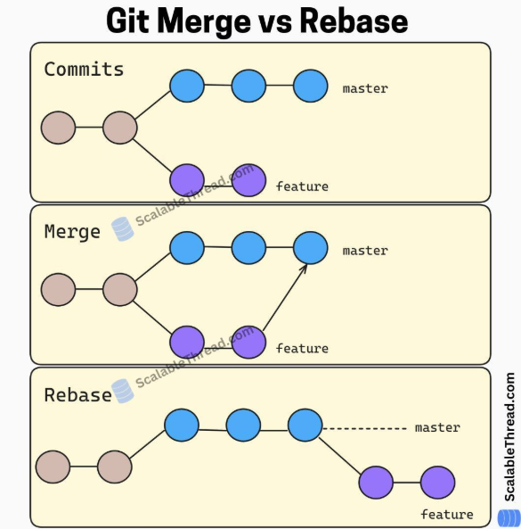

# 📂 Git Toolkit
```bash
# iniciando um novo projeto
>> git init  # na pasta do projeto
>> git add <nome-do-arquivo>  # adiciona o arquivo
>> git commit -m "first commit"  # commit
>> git remote add origin <link-do-github>
>> git push
```
## Comandos
### Clássicos
`git status`: Verifica as mudanças feitas.
`git add .` | `git add <nome-do-arquivo>`: Colocam as mudanças na *staging area (área de preparação)*, esses arquivos estão preparados para a próxima etapa.
    - `git add .`: Adiciona todas as mudanças na pasta atual;
    - `git add nome_do_arquivo.txt`: Adiciona apenas este arquivo.
`git commit -m "Seu comentário"`: Cria um *snapshot (fotográfia)* do projeto no histórico, salva o que está no *staging (feito no add)* com uma mensagem descritiva.
`git push`: Envia seu commit (fotografia) do **repositório local** para o **repositório remoto** (ex: GitHub).
`git pull`: Baixa as mudanças do **repositório remoto** para o **repositório local**.
`git clone`: Baixa um repositório remoto inteiro para sua máquina.
`git rm`: Remove um arquivo do projeto e do controle de versão.
`git mv`: Move ou renomeia um arquivo que está sendo versionado.
`git log`: Mostra o **histórico de commits** do repositório.
`git reset`: Volta o repositório para um commit anterior (desfaz commits).
`git diff`: Pode comparar dois arquivos ou dois commits 
`git grep "texto que deseja procurar"`: Procura o texto dentro do repositório.
`git stash`: Úti quando você precisa mudar de branch mas não quer fazer commit ainda. Isso guarda as mudanças em uma "*pilha*".
`git stash pop`: Recupera as mudanças guardadas no stash.
`git stash list`: Lista todos os stashes.
`git stash show stash@{0}`: Vê o conteúdo de um stash.
`git stash show -p`: Vê o stash mais recente.
### Branches
`git branch`: Mostra todas as braches
`git branch nome-da-branch`: Cria uma nova branch.

<span style="color:#FF8C00">Você não pode excluir uma branch em que você está.</span>
`git branch -d nome-da-branch`: Remove a branch da sua máquina.
`git branch -D nome-da-branch`: Você pode foçar a remoção. O git só deixa deletar se a branch já tiver sido mergeada.
`git push origin --delete nome-da-branch`: Remove uma branch remota (GitHub, GitLab, etc.)
`git switch minha-branch`: Muda de branch.
`git switch -c nova-branch`: Cria uma nova branch.

### Manipulação do histórico
`git reset --soft HEAD~1`: Volta para um commit anterior mas mantém as mudanças no staging.
`git reset --mixed HEAD~1`: Remove o commit e tira as mudanças do staging, mas mantém no código. 
`git reset --hard HEAD~1`: Remove tudo, commit, staging e mudança no código.
`git revert codigo_commit`: Cria um novo commit que desfaz outro commit.
`git rebase -i HEAD~3`: Permite editar commits antigos. Você pode: Juntar commits (squash), alterar mensagens, remover commits, reorganizar commits. Usdo para limpar histórico antes de um PR.
<div style="border:1px solid #FF4500; padding:12px; border-radius:6px; background:#fff5f0">
<span style="color:#FF4500">HEAD:</span>
É o ponteiro de onde você está no seu repositório. Ele aponta para o nome da sua branch atual (como a `main` ou `develop`), e essa branch aponta para o commit mais recente.
- HEAD: O commit atual (o topo)
- ~1: Significa "voltar para um nível na árvore genealógica"
Assim HEAD~1 é o commit imediatamente anterior ao qe você está agora (o "pai" do commit atual)
</div>

---
## Dúvidas
#### Como desfazer um git add?
``` bash
git reset arquivo.txt
# Ou todos os arquivos que estão no add
git reset
# Ou ainda maneiras mais novas
git restore --staged arquivo.txt  # volta apenas esse arquivo
git restore --staged .  # Volta todo mundo
```
#### Como desfazer um git commit?
```bash
# Desfaz o commit mas mantem as mudanças no código:
git reset --soft HEAD~1  # remove o commit mas mantém o add
git reset --mixed HEAD~1  # remove o commit e o add mas mantém o código
git reset --hard HEAD~1  # desfaz tudo, commit, add e mudanças no código
git revert <hash_do_commit>  # novo commit que desfaz o anterior sem apagar o histórico
```
#### Qual a diferença entre `merge` e `rebase`?

`merge`: Junta os históricos (mantém a linha do tempo original)
`rebase`: Replica os commits em outra base (deixa o histórico linear)
#### Como resolver conflitos de merge?
Editando os arquivos marcados com `<<<<<<<` e depois fazendo `git add` e `git commit`
#### Como voltar em uma versão especifica do meu código?
```bash
git log --oneline  # Vê os hashs para conseguir saber em qual voltar
git log  # Vê os commits bem detalhados

git revert --no-commit <hash-do-commit-que-deseja-voltar> ..HEAD
git commit -m "Reverte alteração para o estado xpto"
git push origin main
```
#### Como sempre evitar conflitos?
```bash
git pull origin branch_especifica
```