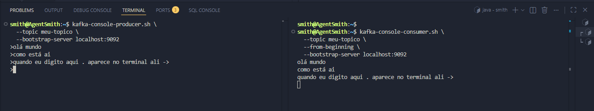

# KAFKA
O `Kaafka` para funcionar precisa de um `cluster` ativo. Para gerar um cluster ID fazemos:
```bash
kafka-storage.sh random-uuid
```
Ele irá devolver um `hash` como:
> xBx7ZSH2RP-TahHSPYYLyw
Você precisa ir para onde seu kafka está instaldo:
```bash
# isso mostra onde ele está instalado
which kafka-topics.sh
```
Entre na pasta usando `cd`.
Confira se o arquivo config/kraft existe:
> ls config/kraft/


Formatamos o storage fazendo
```bash
# seu uuid aqui foi o criado no primeiro passo
kafka-storage.sh format -t <SEU_UUID> -c config/kraft/server.properties
```
Retorna algo parecido com isso:
> Formatting /tmp/kraft-combined-logs with metadata.version 3.8-IV0.

# Subindo o KAFKA
Agora podemos subir o `KAFKA`, para isso rodamos:
```bash
# no mesmo diretorio que você formatou o storage (/opt/kafka)
kafka-server-start.sh config/kraft/server.properties
```
Pronto agora você tem o `KAFKA` rodando deixe este terminal vivo pois se encerrar ele o `KAFKA` deixa de existir também.
Em outro terminal rode:
```bash
# se não der erro o kafka está online
kafka-topics.sh --list --bootstrap-server localhost:9092
```

# Criando o Tópico Kafka
```bash
kafka-topics.sh --create \
  --topic meu-topico \
  --bootstrap-server localhost:9092 \
  --partitions 1 \
  --replication-factor 1
```
Isso vai retornar algo como:
> Created topic meu-topico.

## Produzindo mensagens
```bash
kafka-console-producer.sh \
  --topic meu-topico \
  --bootstrap-server localhost:9092
```

## Consumindo as mensagens
```bash
kafka-console-consumer.sh \
  --topic meu-topico \
  --from-beginning \
  --bootstrap-server localhost:9092
```
